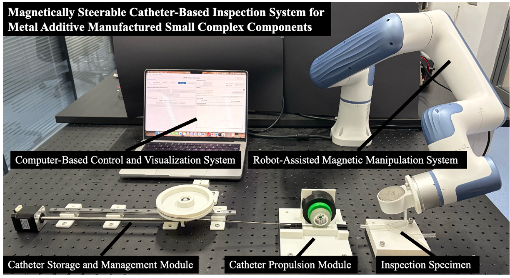

# Motorized Catheter Accumulation System

A research prototype for managing the free length of a long, flexible catheter with a translating large-pulley accumulator driven by a lead-screw stepper stage.

> [!IMPORTANT]
> This repository documents only the catheter accumulation and recovery mechanism. The magnetic steering robot, catheter propulsion module, and demonstration specimen shown in the system overview are integration context and are not implemented in this repository.

## 1. Overview

Long magnetic catheters require controlled length management during experiments. Unmanaged excess length can bend unpredictably, become entangled, reduce experimental repeatability, and make manual handling difficult.

This prototype addresses that problem with a motorized translating-pulley accumulator. A large guiding pulley is mounted on a linear carriage and moves along an MGN12 rail. The catheter is routed around the pulley, so translating the carriage changes the available routing length without winding the catheter onto a rotating spool. A T8 lead screw and stepper motor provide linear actuation, while an Arduino UNO and a Python desktop application provide motion control.

The intended use is laboratory research involving long flexible catheters, including experiments in which the accumulator operates alongside a separate propulsion mechanism and robotic magnetic steering system.

## 2. System Architecture



The overview image shows the complete experimental setup. The accumulator is the linear module at the lower left; the other labeled modules are outside this repository's scope.

The accumulator consists of three functional layers:

- **Catheter accumulation mechanism:** a large pulley with a catheter groove redirects the catheter and changes the managed path length as it translates.
- **Linear motion stage:** an MGN12 rail, MGN12H carriage, carriage adapter, T8 lead screw, and motor convert rotary motion into controlled horizontal translation.
- **Motor control system:** a Python host application communicates with an Arduino UNO over USB serial. The Arduino generates `STEP` and `DIR` signals for a TB6600 stepper driver.

## 3. Mechanical Design Principle

The mechanism is a translating pulley accumulator, not a reel or driven spool. The pulley rotates passively to guide the catheter, while the entire pulley assembly translates along the linear axis.

```text
Stepper motor rotation
        |
        v
Lead screw rotation
        |
        v
Lead-screw nut translation
        |
        v
Linear carriage movement
        |
        v
Large pulley translation
        |
        v
Change in catheter routing length
        |
        v
Catheter accumulation or release
```

When the moving pulley is supported by two approximately parallel catheter segments, translating it changes both segments by nearly the same amount. The first-order geometric relationship is therefore:

**ΔL ≈ 2Δx**

where:

- `ΔL` is the change in managed catheter length.
- `Δx` is the pulley translation distance.

This approximation assumes that the fixed routing points remain stationary and that changes in wrap geometry, catheter stretch, slip, and elastic deformation are small. The sign of `ΔL` depends on the selected positive carriage direction and routing convention.

## 4. Hardware Components

### Mechanical components

| Component | Specification or role |
| --- | --- |
| Linear rail | MGN12, 400 mm guide rail |
| Linear carriage | MGN12H carriage block |
| Carriage adapter | 3D-printed interface between the carriage, pulley assembly, and lead-screw nut |
| Guide pulley | Large pulley with a U-shaped catheter groove |
| Pulley bearings | 608 bearings supporting passive pulley rotation |
| Pulley shaft | Vertical shaft through the bearing-supported pulley |
| Pulley support | 3D-printed support structure for the shaft and bearings |
| Lead screw | T8 lead screw with an 8 mm lead |
| Nominal actuator travel | 300 mm mechanical travel; the supplied control software limits commanded position to 0-280 mm |

### Electrical components

| Component | Role |
| --- | --- |
| Arduino UNO R3 | Serial command handling and real-time step-pulse generation |
| TB6600 stepper driver | Motor phase-current control from `STEP` and `DIR` inputs |
| Lead-screw stepper motor | Drives the T8 lead screw |
| 24 V, 1.5 A laboratory supply | Powers the motor driver and stepper stage |
| Computer | Runs the Python control interface and supplies the USB serial connection |

The firmware is configured for a 200-full-step motor, 8 microsteps, and an 8 mm lead screw, which gives 200 command pulses per millimetre. Confirm the motor, driver switch settings, lead-screw lead, and available supply current before operation.

## 5. Electronics Connection

### Control chain

```text
Computer
   |
Python interface
   |
USB serial at 115200 baud
   |
Arduino UNO R3
   |
STEP / DIR
   |
TB6600 driver
   |
Stepper motor
   |
T8 lead screw and translating pulley carriage
```

### Arduino-to-driver signals

The supplied firmware uses the following common-anode input wiring:

| Arduino UNO | TB6600 input |
| --- | --- |
| `5V` | `PUL+` and `DIR+` |
| Digital pin `D2` | `PUL-` |
| Digital pin `D3` | `DIR-` |
| Not connected | `ENA+` and `ENA-` |

The 24 V supply connects to the TB6600 power input, and the stepper motor connects to the driver's motor outputs according to the driver and motor documentation. Disconnect power before changing wiring. Do not power the motor from the Arduino.

If the application's **Forward** command produces the wrong physical direction, change `FORWARD_DIR_LEVEL` in the Arduino firmware from `HIGH` to `LOW`, then compile and upload it again.

## 6. Software Usage

### Arduino firmware

The Arduino sketch is located at:

```text
Software/Arduino/Catheter_Accumulator_Controller/Catheter_Accumulator_Controller.ino
```

To upload it:

1. Disconnect motor power and verify the signal wiring.
2. Open the sketch in the Arduino IDE.
3. Select **Arduino UNO** and the correct USB serial port.
4. Compile and upload the sketch.
5. Reconnect motor power only after checking the driver current and microstep settings.

No third-party Arduino library is required. The sketch uses Arduino core headers and standard C/C++ headers.

### Python controller

The host application is located at:

```text
Software/Python/Catheter_Accumulator_Controller.py
```

Python 3 with Tkinter is required. Create an isolated environment and install the serial dependency:

```bash
cd Software/Python
python3 -m venv .venv
source .venv/bin/activate
python -m pip install -r requirements.txt
python Catheter_Accumulator_Controller.py
```

On Windows, activate the environment with `.venv\Scripts\activate` before running the final two commands. If Tkinter is not included with the Python installation, install the platform's Tk package separately.

### Initial operation

1. Power the control electronics and start the Python application.
2. Refresh the serial-port list, select the Arduino, and connect.
3. At low speed, hold the jog control to move the carriage to the chosen mechanical zero position.
4. Select **Set Current Position = 0**.
5. Enter the desired speed, acceleration, and move distance, then command forward or reverse motion.
6. Use **STOP** immediately if the mechanism approaches an obstruction or travel boundary.

The application supports manual jogging, fixed-distance moves, speed and acceleration settings, status reporting, and stop commands. Communication uses newline-terminated ASCII messages at 115200 baud.

> [!WARNING]
> The prototype has no encoder, home sensor, physical limit switch, tension sensor, or emergency-stop circuit. Position is estimated from generated step pulses. The Arduino returns to `UNCALIBRATED` after every reset or power cycle, so the carriage must be re-zeroed manually. The 0-280 mm software limits do not replace physical travel protection.

The firmware communication watchdog stops motion if valid host contact is absent for more than one second. Begin commissioning with low speed and short moves, keep a power disconnect accessible, and prevent the catheter, wiring, and operator from entering pinch points.

## 7. CAD Files

Native CAD sources are stored in [`Hardware/CAD`](Hardware/CAD). They include the large guide pulley, MGN12H carriage adapter, rail base platform, fixed catheter clamp, and compliant-pad mold components.

The current archive contains Autodesk Fusion `.f3d` files and one SOLIDWORKS `.SLDPRT` file. It does not yet include validated STL exports, STEP exchange files, manufacturing drawings, tolerances, or print settings. See the [CAD inventory](Hardware/CAD/README.md) for file-level descriptions.

## 8. Repository Structure

```text
Motorized-Catheter-Accumulator/
├── README.md
├── system_overview.png
├── Software/
│   ├── Arduino/
│   │   └── Catheter_Accumulator_Controller/
│   │       └── Catheter_Accumulator_Controller.ino
│   └── Python/
│       ├── Catheter_Accumulator_Controller.py
│       └── requirements.txt
├── Hardware/
│   └── CAD/
│       ├── README.md
│       ├── Ecoflex_Pad_Mold_Bottom.f3d
│       ├── Ecoflex_Pad_Mold_Top.f3d
│       ├── Fixed_Catheter_Clamp.f3d
│       ├── Guide_Pulley_120mm.f3d
│       ├── Linear_Rail_Base_Platform.SLDPRT
│       └── MGN12H_Carriage_Adapter.f3d
└── .gitignore
```

## 9. Future Development

Possible research extensions include:

- Closed-loop carriage position control with an encoder or linear scale.
- A repeatable homing procedure using limit or home sensors.
- Direct measurement of catheter tension and automatic tension regulation.
- Physical end-of-travel protection and a dedicated emergency-stop circuit.
- Calibration of the relationship between carriage displacement and managed catheter length.
- Coordinated control with a separate catheter propulsion module.
- Integration with a robotic magnetic steering system for complete experimental workflows.

## Research Status

This repository describes an academic research prototype. It is not a medical device, a clinical system, or a commercial product. Verify all mechanical, electrical, and software behavior independently before experimental use.

No open-source license has been granted. Because this is a private research repository, redistribution and reuse require permission from the project owner.
